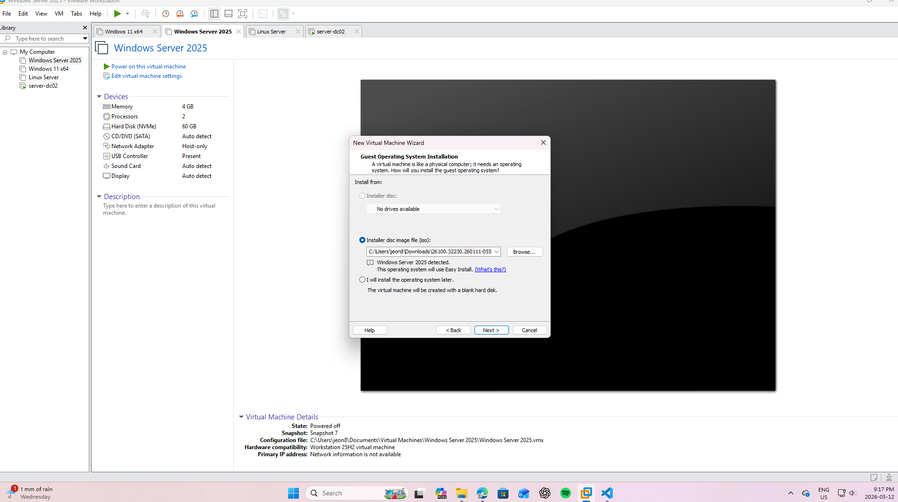
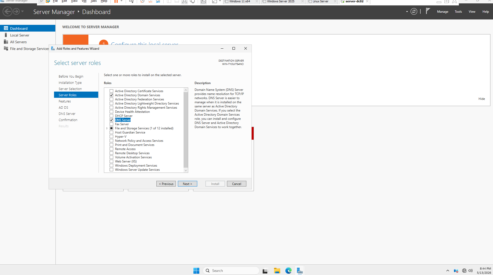
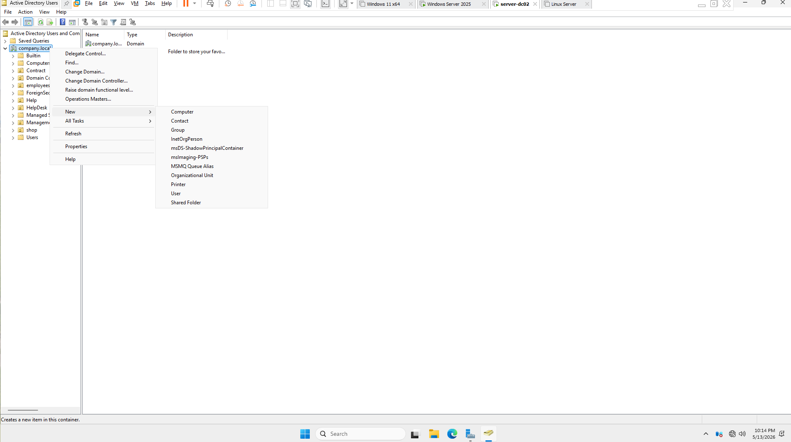
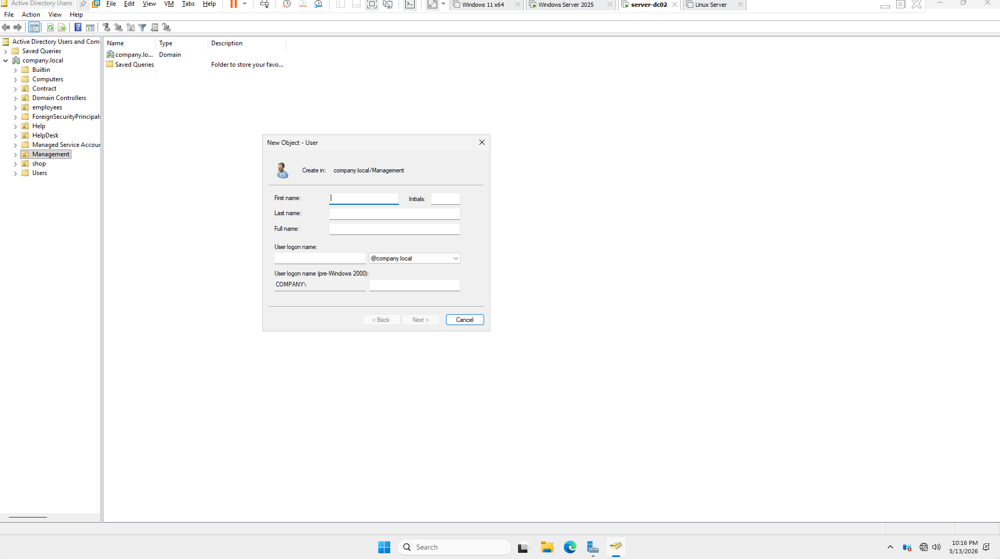

- Domain setup 

1. Install Windows Server <VM> 

2. Install AD DS role 

  DC 01<MAIN> : ADDS + DNS + DHCP
  DC 02<REDUNDANCY> : ADDS + DNS + NO DHCP

3. * Promote server * 

4. create a new forest

5. create #Organizational Unit in Users and Computers 

6. create Users   

