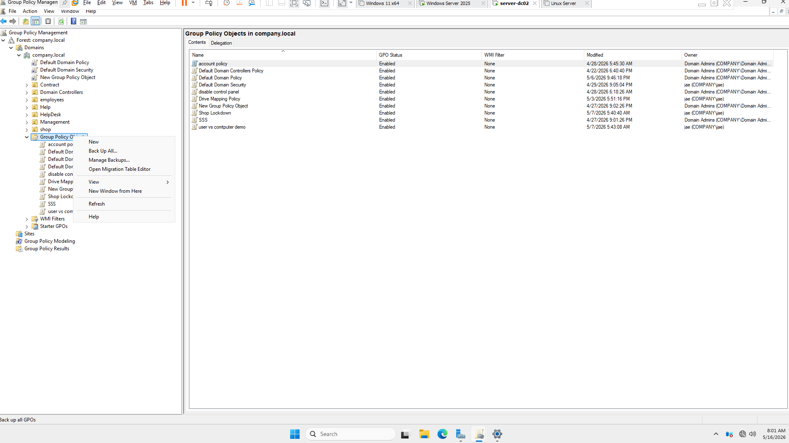
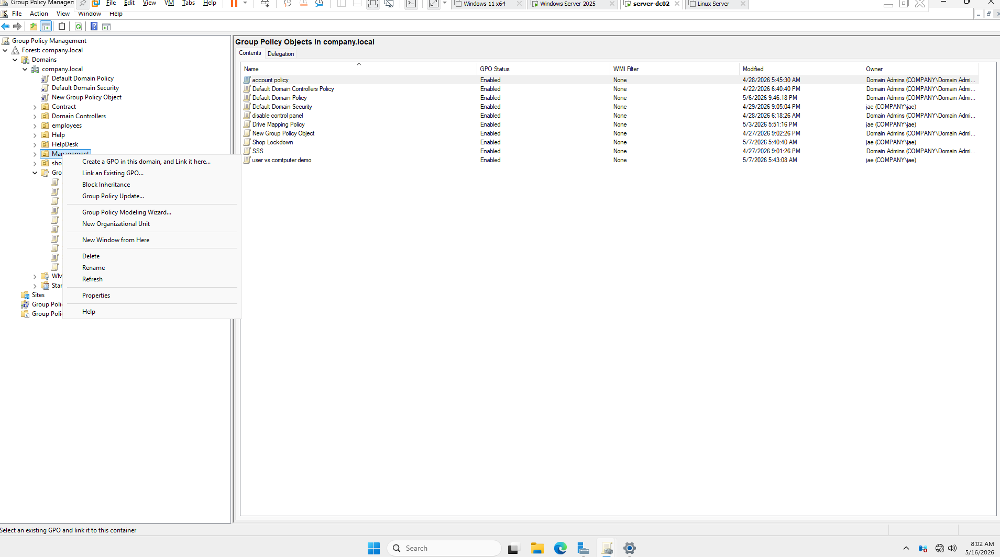

- GPO configuration 

1. open Group Policy Management < gpo management vs gpo editor> 

2. go to the domain you created and expand / Expand Group Policy / New 

3. * Make sure to link to OU where you want to apply, otherwise the gpo would not be applied 

4. right click the gpo you just made and go to Edit <gpo management vs gpo editor> 
      

- always follow the order. 1.create gpo 2. link to ou 3. right click the gpo and go to edit<gpo editor> 