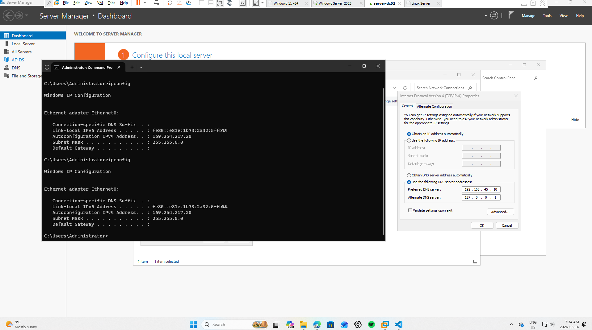

-domain connect issue.
   
     most of cases cased by DNS issue - check ip address<ipconfig>, adapter settings
    

 ipv4 address : 169.254.x.x  --> APIPA assigning ip address --> Check DHCP server  
  
  
  
  -> I accidently turned off the ADDS server vm during operation. And once it turned back on, the DHCP service resumed.