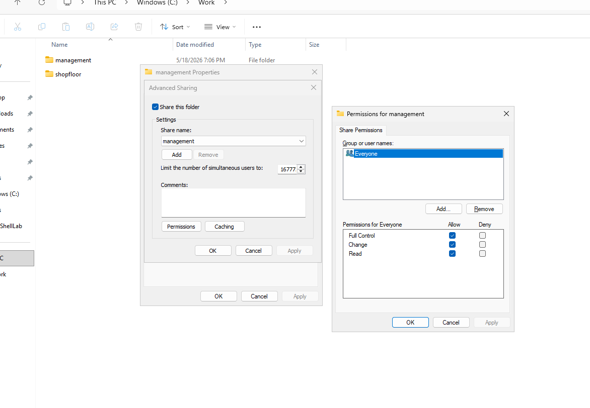
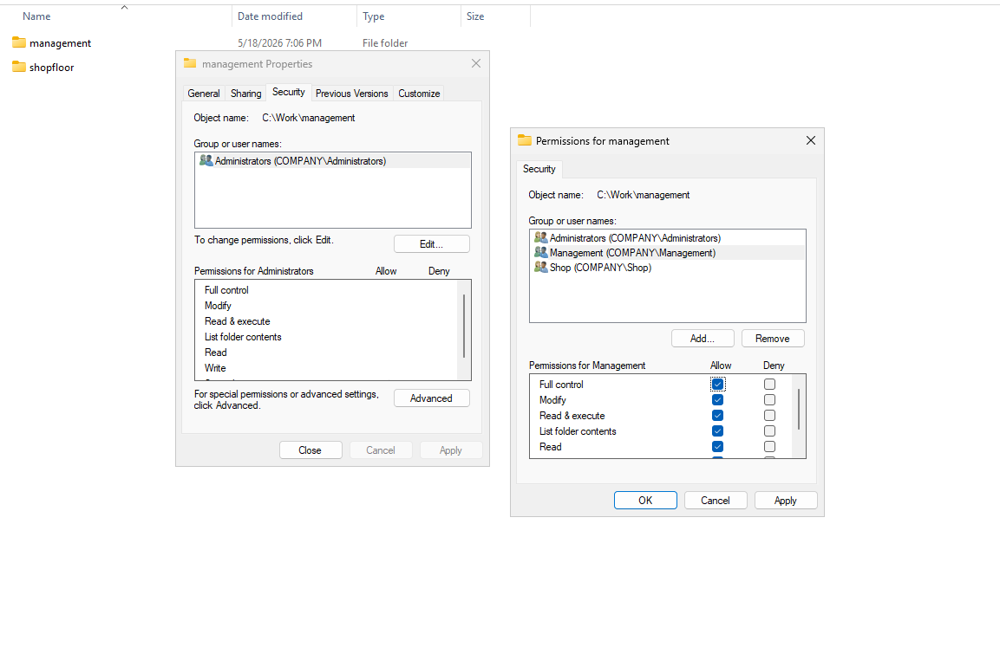
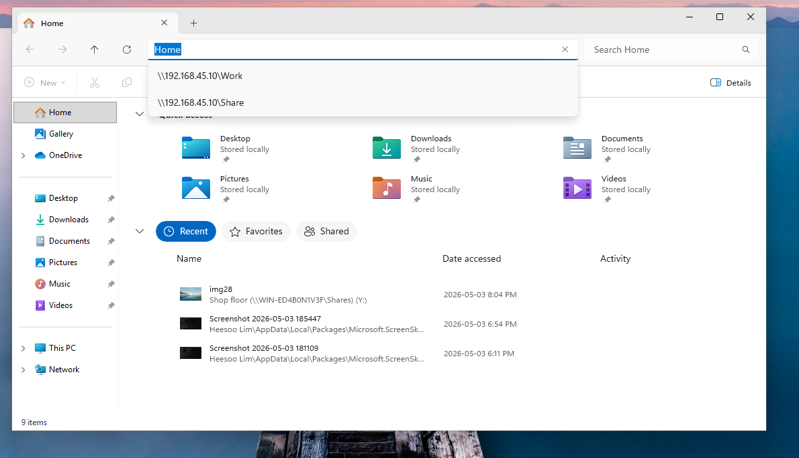
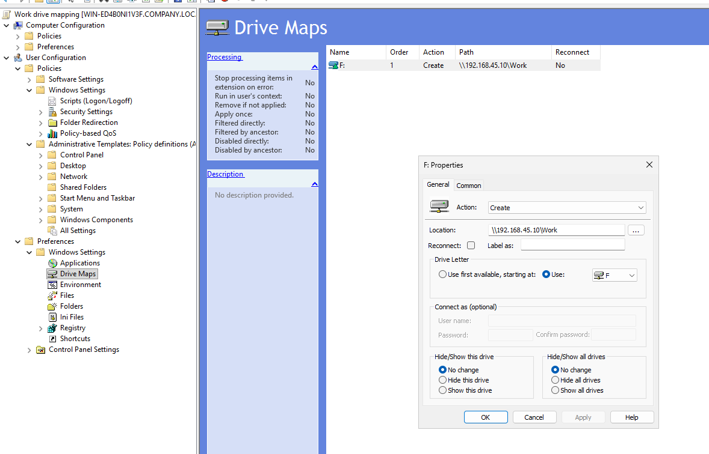

# NTFS, SHARE permission setup

1. create a folder  
>>>>>Work
>>>>- management 
>>>>- shopfloor

 
 

2. share permission

>>>right click-properties-sharing-advanced sharing

 

3. NTFS permission

>>>right click-properties-security-advanced sharing
>>>>management-full control, shop-read only 

  

4. Check shared file access / NTFS permission at client vm
>>type : \\\server ip address\shared file  
>>ex)  : \\\192.168.45.10\Work

  

# Drive mapping

Create drive mapping group policy in Group Policy Management  
<*make sure to link OU in domain once group policy is created>

>>User Configuration - Preferences - Windows settings - Drive Maps
>>>Action : Create  
Location : \\\server ip\file name 
Drive Letter : ex)F

  

