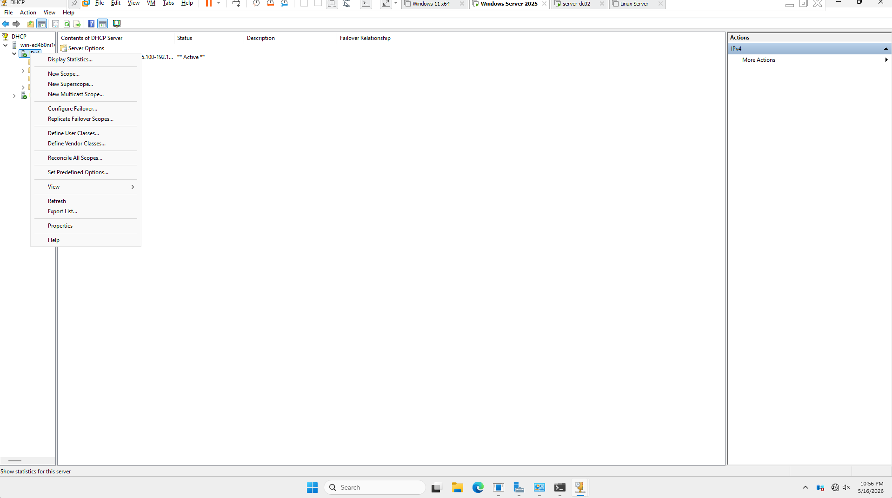
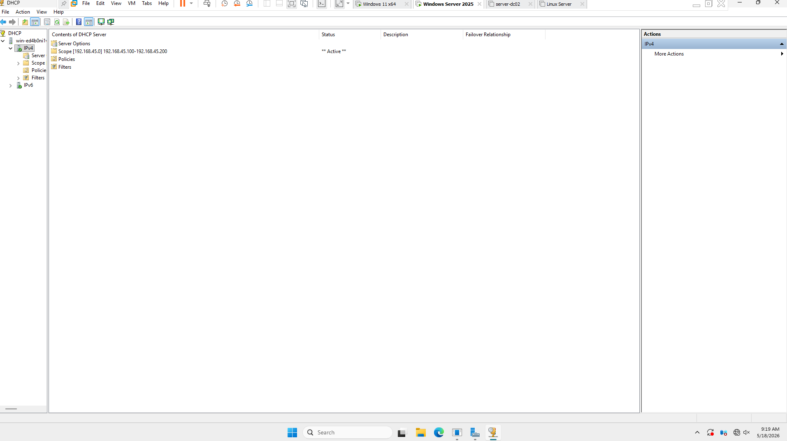
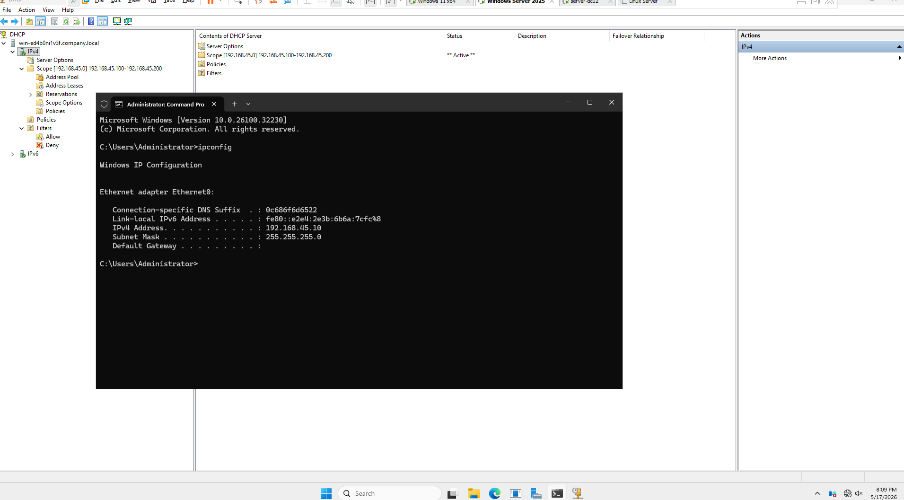

# DHCP configuration 

## _windows server_ *ADDS*
   
    IP : 192.168.45.10 
    SUBNET : 255.255.255.0
    DEFAULT GATEWAY : 192.168.2.1 <home router ip address>
    DNS : 192.168.45.10 <server(ADDS) itself for domain connection>

## _DHCP scope_
   
    IP   192.168.45.100 - 192.168.45.200

## _Windows Client VM_
   
    IP : 192.168.45.100
    SUBNET : 255.255.255.0
    DEFAULT GATEWAY : 192.168.2.1
    DNS: 192.168.45.10 <same server ip address for domain connection>

1. Add roles and Features - install dhcp server - ipv4 - New Scope...

 
 
2. _DHCP configuration_

 

3. windows server (active directory domain controller)

 

