# opnsense installation $ setup

Networking homelab

                           HOME NETWORK TOPOLOGY

                                    Internet
                                        │
                                        │
                              ┌─────────────────┐
                              │  ISP Home Router│
                              └─────────────────┘
                                        │
                                        │
                                 WAN Network
                                        │
                                        ▼
                     ┌─────────────────────────────┐
                     │     PC03 <I350 T2 NIC>      │
                     │      OPNsense Firewall      │
                     │                             │
                     │                             │
                     └─────────────────────────────┘
                                   │
                                   │
                                   │ LAN Network
                                   ▼
                            ┌─────────────┐
                            │ 8-Port      │
                            │ Switch      │
                            └─────────────┘
                                  │
                      ┌─────────────────────────┐
                      │           │             │
                      ▼           ▼             ▼
                   PC01          PC02        pc03
                 

Hardware List:
- PC01 (Client, Widows 11)  (Dell Optiplex i5-10500T, 32GB RAM)
- PC02 (Client, Linux bare metal)  (Lenovo Tiny   i5-8500T,  16GB RAM)
- PC03 (OPNsense VM Host, Proxmox bare metal)  (Lenovo Tiny   i5-8500T,  16GB RAM,  Dual port I350 NIC Installed)
- 8-Port Gigabit Switch

Current Objectives:
- Install and configure OPNsense
- Configure WAN/LAN networks
- Provide DHCP and DNS services
- Connect client devices through OPNsense

## 1. Install & Verify double port NIC card on pc03

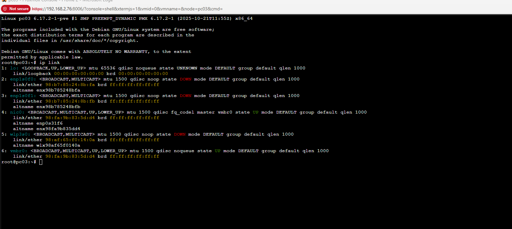

>>* enp1s0f0 : NIC port 1
>>* enp1s0f1 : NIC port 2
>>* nic0     : Onboard Ethernet port
>>* wlp3s0   : WIFI card

## 2. Install opnsense

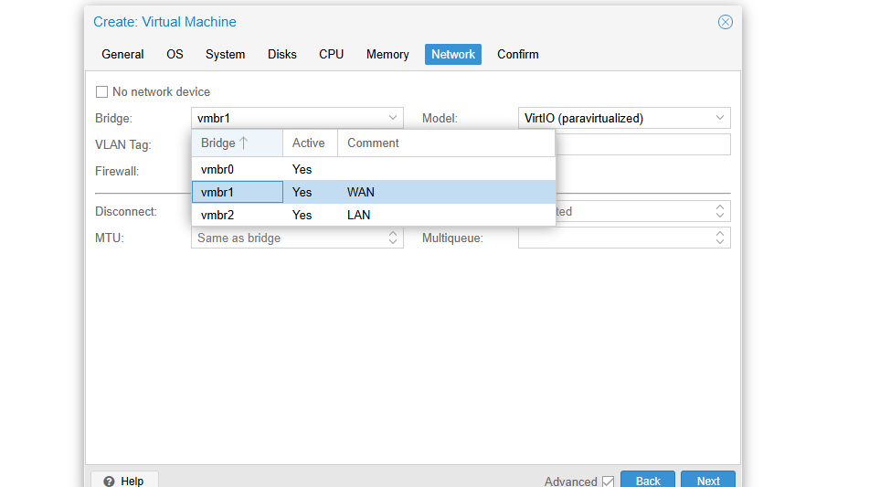

configure 2 ports to WAN/LAN
>vmbr1 - WAN(internet)

>vmbr2 - LAN(local)

## 3. Check LAN/WAN ip address

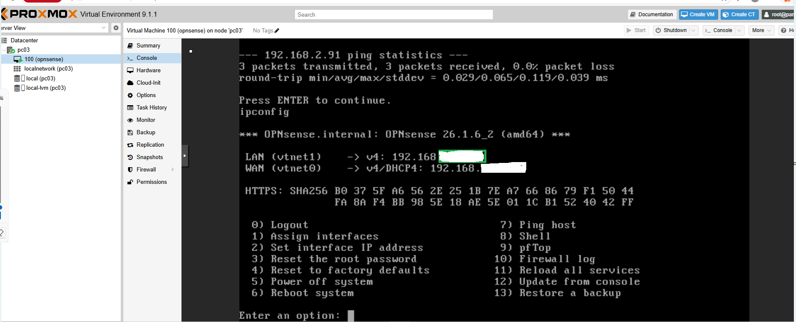 

LAN-STATIC IP ADDRESS ; because it is supposed to be switch connected device's gateway 
WAN-DHCP ASSIGNED ADDRESS ; client side of ISP router

## 4. DHCP CONFIGURATION

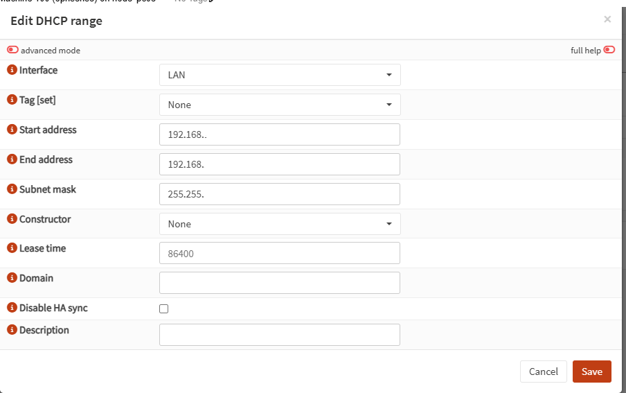

!!! But for the better SSH linux server on pc02, I will set pc02 ip address to DHCP reserved IP !!!

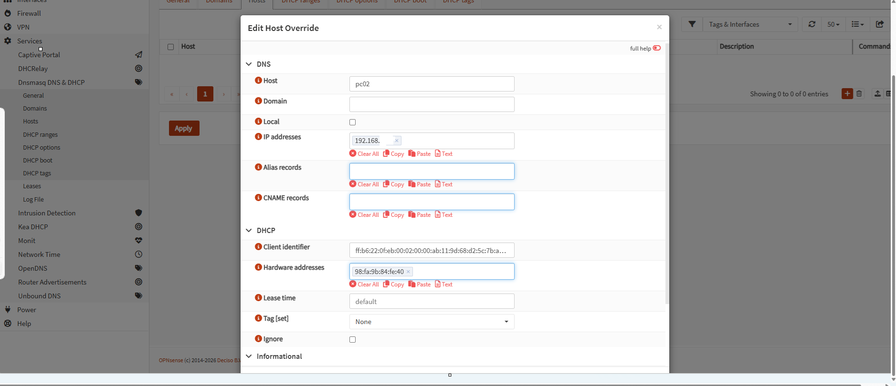

## 5. Firewall Rule Setup
+ Block Ping (block ICMP)
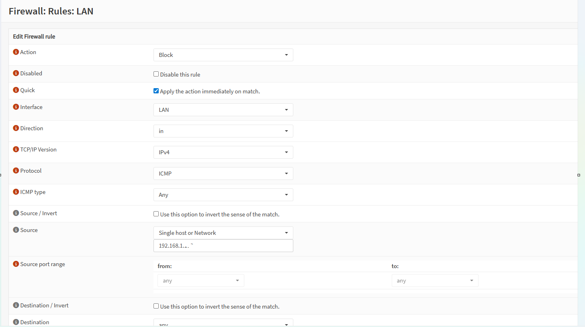

+ Make sure to move the rule on the top 
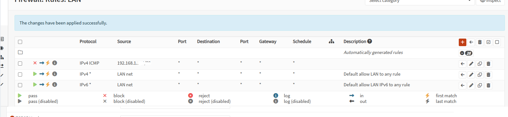

+ ping google.com test => Request timed out.

## 6. Allow DNS only

For this rule, We need two set of rules. One for Allowing DNS rule, and other for Blocking Everything Else

+ Allow DNS 

action : pass 
protocol : TCP/UDP 
source : target pc ip address <pc03 windows 11 client> 
destination : any 
port : 53(DNS) 

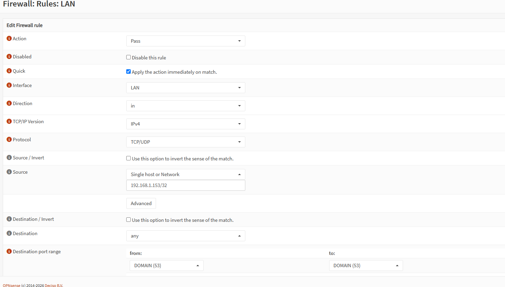

+ Block Everything  

action : block 
protocol : any 
source : target pc ip address <pc03 windows 11 client> 
destination : any 

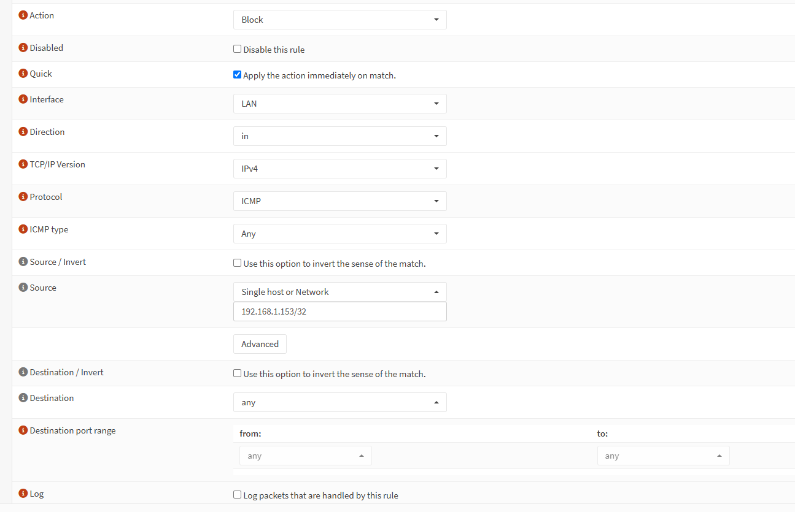

## 7. VLAN setup

1. create a new BRIDGE 

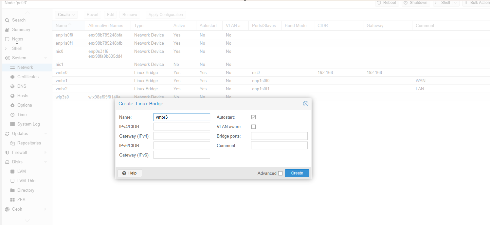

*vmbr  = Virtual Machine Bridge

*vmbr0 = port connected from port1 on PC3 to ISP router 

*vmbr1 = port connected from port1 on PC3 to ISP router (WAN) 

*vmbr2 = port connected from port1 on PC3 to switch (LAN)

!!!vmbr3 = new bridge for VLAN setup!!!

2. add a new Network Device (Proxmox - Hardware - add network device) 

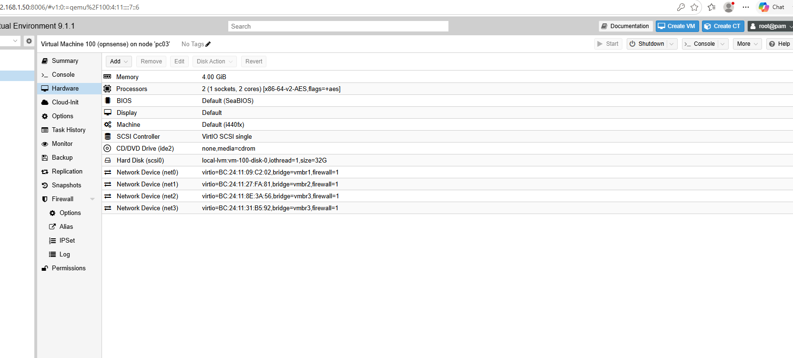

3. configure new IPv4 for VLAN (OPNsense - Interfaces - Assignments) 

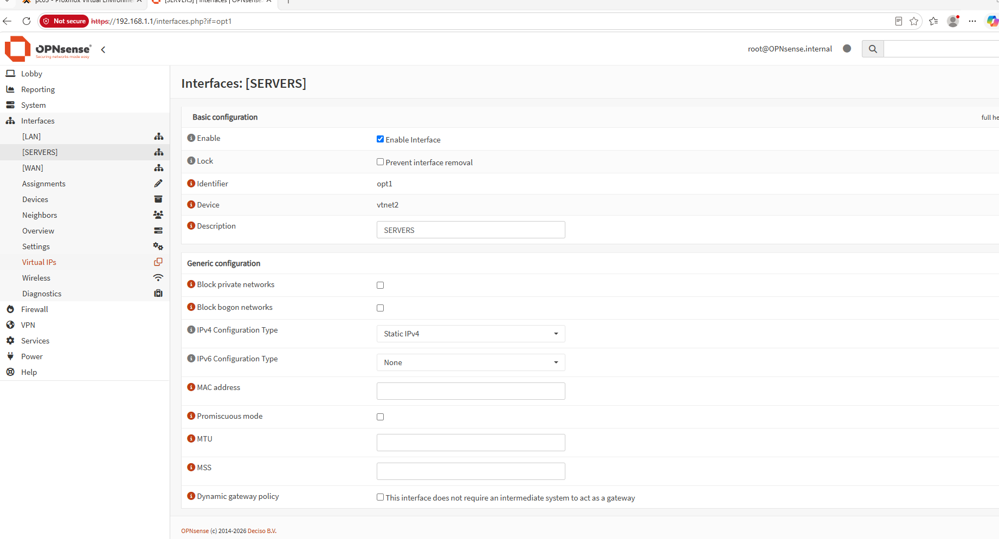

*Prefix 8 > 255.0.0.0

*Prefix 16 > 255.255.0.0

*Prefix 24 > 255.255.255.0

*Prefix 32 > 255.255.255.255

4. DHCP configuration for VLAN (OPNSENSE - Services - Kea DHCP -kEA DHCPV4) 

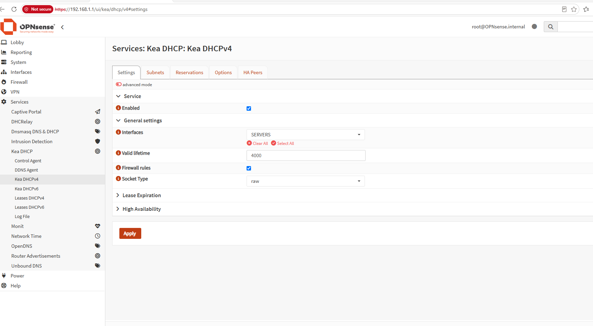