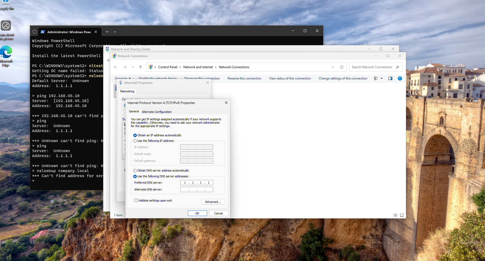
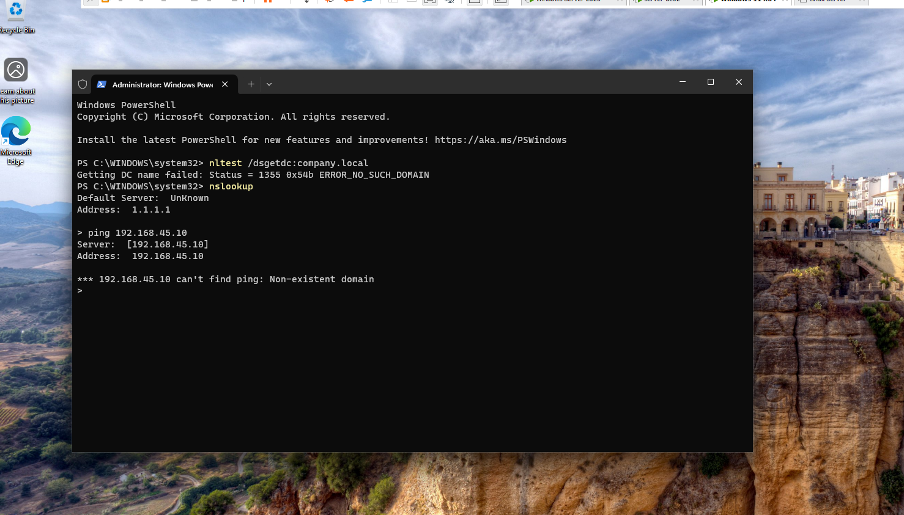
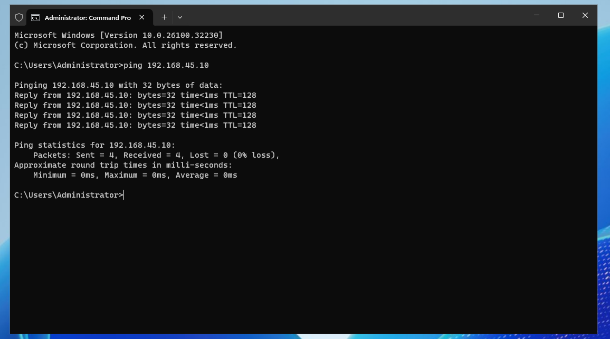
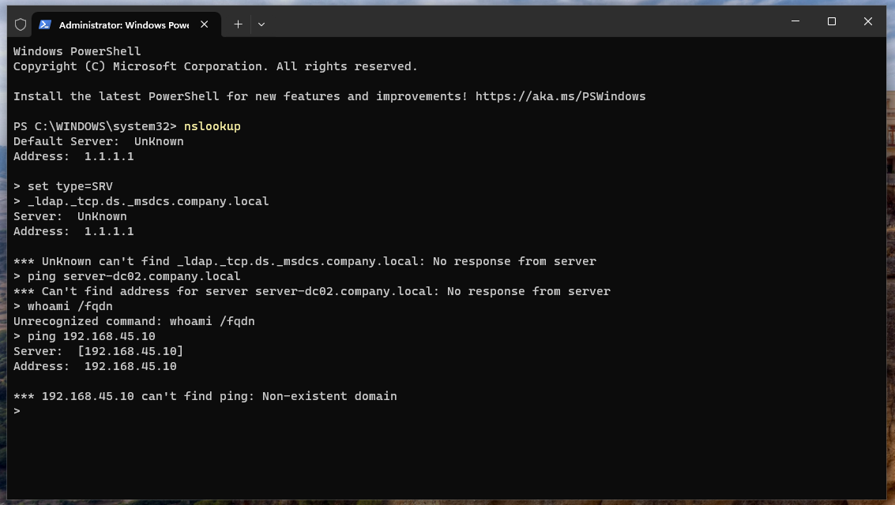

# Breaking DNS on purpose & fix it

## 1. Change DNS from 192.168.45.10 --> 1.1.1.1

## 2. Check DNS status (Domain joining failed)

+ CMD - gpdupate /force, ipconfig /flushdns 
+ Powershell - whoami /fqdn, ping company.local

Domain joined    

vs

Not joined

## 3. Fix/change back to domain controller ip : "192.168.45.10"
>>1.1.1.1 --> 192.168.45.10  
>>CMD: ipconfi /flushdns,   gpupdate /force

## 4. Test Again
>>CMD: ipconfig /all, ping company.local